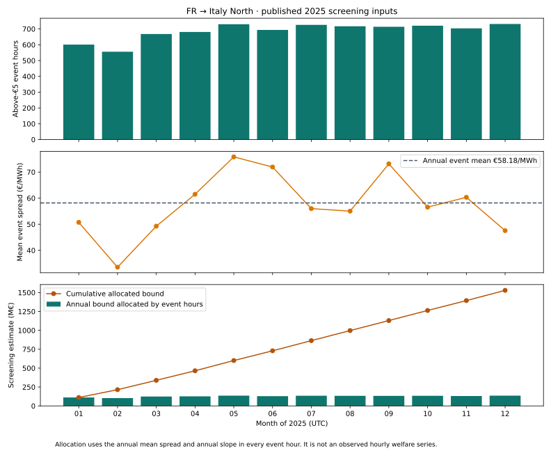
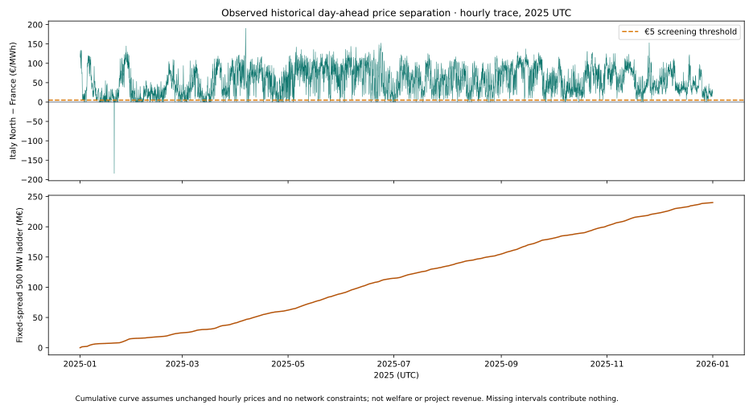

# Why does France–Italy show €1,529.8 million/year?

The number is an **experimental screening welfare bound**, not a €1,529.8 million price difference, measured deadweight loss or a forecast of project revenue. Its magnitude deserves scrutiny before using it for investment decisions.

## Hour-by-hour historical price trace

This is an observed historical day-ahead price trace, using public Energy-Charts / SMARD data for the same bidding zones, rather than the unavailable original ENTSO-E cache. Coverage is **8,759 of 8,760 UTC hours**; the final hour of 31 December is missing and is not fabricated. Hourly source prices are applied to their four quarter-hours; quarter-hour prices are averaged only when all four observations exist.

The top panel plots Italy North minus France hour by hour. The lower panel sums 500 MW × positive hourly spread × one hour. It reaches **€240.0118 million**, compared with the published screening ladder of €240.0292 million. This is a useful cross-source sanity check, not exact input parity: the original screening additionally uses a scheduled-flow coverage mask, and its event statistics are quarter-hour based.

The cumulative curve is **not** €1.53 billion of measured welfare. It assumes prices never respond to the added 500 MW and ignores network constraints. The larger screening bound comes from the modelled triangle below.

[Download all hourly prices and spreads (CSV)](../public/research/fr-it-screening/hourly-prices.csv) · [Source URLs, hashes, licence and coverage](../public/research/fr-it-screening/price-trace-provenance.json). Attribution: Bundesnetzagentur / SMARD.de via Fraunhofer ISE Energy-Charts, CC BY 4.0, as reported by the API. Processing and charts by Grid Conductor.

The first chart separates published monthly event hours, monthly mean spreads and an allocation of the annual model estimate. Its bottom panel is an accounting allocation using the annual mean response, not observed hourly welfare.

## The actual calculation

For FR → Italy North, the published 2025 source contains:

| Input | Value |
| --- | ---: |
| Known quarter-hour samples | 35,040 |
| Samples with Italy's price more than €5/MWh above France | 32,972 |
| Corresponding event hours H | 8,243 |
| Mean spread during those events S | €58.1774/MWh |
| Border quantity used by the fallback C | 3,190 MW |
| Raw French price/inflow regression slope | −0.00141381 |
| Effective slope k | 0.00911871 €/MWh per MW |

Because the raw French regression slope is negative, the screening replaces it with the heuristic fallback:

$$k = \frac{S}{2C}.$$

It assumes the marginal spread after extra trade q is S − kq. Integrating that triangular area until the assumed spread reaches zero gives:

$$D = \frac{H S^2}{2k\,10^6} = \frac{HSC}{10^6} = 1{,}529.7838952\ \text{M€/year}.$$

The assumption implies **6,380 MW of additional trade** at saturation. This is twice the quantity used to size the fallback, not a demonstrated feasible expansion of the France–Italy network.

A 500 MW intervention captures a smaller trapezoid in the same model:

$$B_{500} = \frac{H(500S - k500^2/2)}{10^6} = 230.38235\ \text{M€/year}.$$

That is still an unvalidated gross screening estimate, before construction cost, losses, outages and network effects. The separate fixed-spread 500 MW ladder is €240.03 million/year; it assumes no price response and is a different quantity.

## What the accumulation chart does

For each month m, the bottom panel allocates the annual bound according to that month's above-€5 event hours:

$$D_m^{allocation} = \frac{H_m S_{annual}^2}{2k_{annual}\,10^6}.$$

These contributions sum exactly to €1,529.7838952 million. Their cumulative line makes the annual scale visible. Monthly mean spreads in the middle panel are the published monthly diagnostics; they are **not** substituted into this allocation. Independently refitted monthly welfare estimates need not sum to the annual mean-spread model.

## Why confidence should be limited

A large observed price separation is useful evidence of differing marginal market conditions. It does not establish that this entire triangle can be captured by transmission. The fallback response is an assumption, rather than a calibrated causal response to a new cable. Scheduled-flow capacity conventions, internal congestion, alternative paths, hydro inventories and the interaction with the rest of Europe can substantially change benefits.

The annual source also has a reverse Italy North → France estimate of €18.146 million, based on only **two event hours** and a different fitted slope. It should not be treated as equally robust evidence. The combined map edge sums eligible directional targets: these two published components total €1,547.93 million/year. The directional selection panel can still show the forward €1,529.8 million component explained here.

**Use this as a prioritisation indicator, not an investment valuation.** A matched chronological network baseline and intervention comparison is the next valuation step. The separately published 2025 conditional 48-hour benchmark is not an annual France–Italy valuation.

## Reproduction and remaining input limits

[Underlying annual/monthly values and allocated contributions](../public/research/fr-it-screening/explanation.json) retain the source hash. Reproduce the chart with `tools/publish_fr_it_accumulation.py` using the scientific Python environment.

Exact replication of the original screening requires the original ENTSO-E A44 prices and A11 scheduled flows for both zones, aligned to the same UTC quarter-hour grid and coverage mask. It should show signed price spreads, the above-€5 event filter and cumulative sums, while keeping the annual assumed triangle distinct from observed price/flow products. No prices or intervals have been invented to fill that gap.

The public price trace is reproduced by `tools/publish_fr_it_prices.py` from the source responses cached in ignored `data/price-trace/`. The sources are public and require no API credential.
