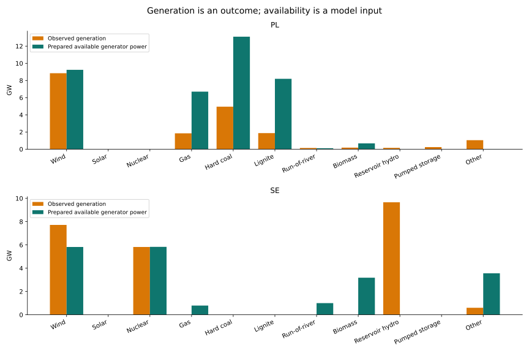
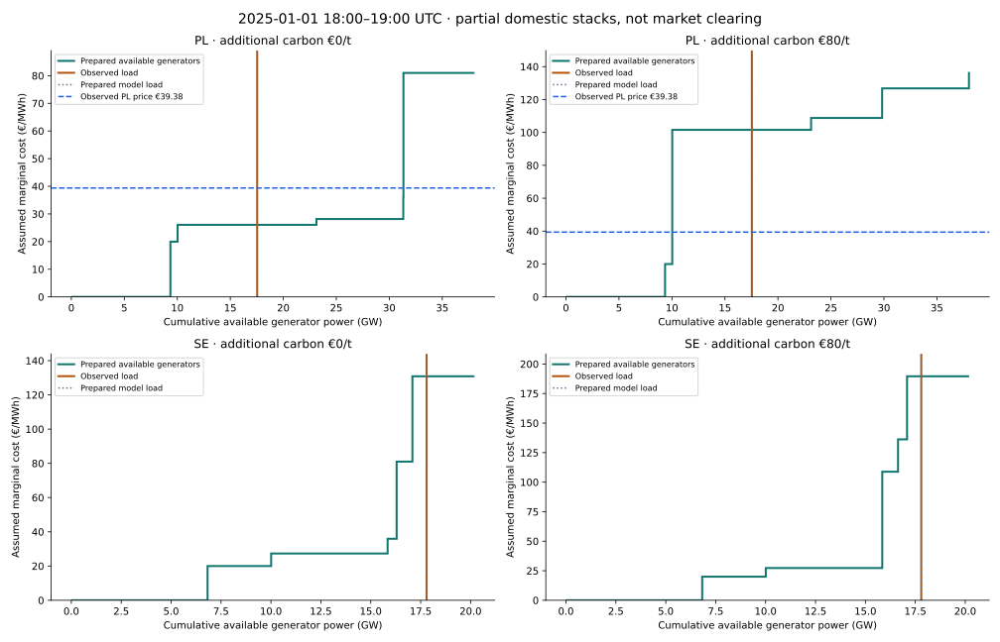

# Estimating supply and demand from generation data

We can construct a **cost-based supply stack**, but it is not an observed auction bid curve. This pilot combines public historical generation and load with the prepared 2025 fleet and renewable availability. It shows both what works and where calibration is still missing.

The snapshot is **1 January 2025, 18:00–19:00 UTC**, for **Poland and Sweden as national aggregates**. A New Year holiday hour is not representative of a whole year. Sweden includes all four bidding zones; it must not be described as SE4.

[Machine-readable inputs and results](../public/research/supply-stack-pilot/results.json) · [Price-screening geometry](screening-data-visual-walkthrough.md) · [2025 network benchmark](2025-conditional-network-benchmark.md)

## 1. Observations versus model inputs

Historical public net generation and load come from **Fraunhofer ISE Energy-Charts**, using its public API and underlying reporting sources. This is a new observational comparison dataset, not the unavailable raw screening banks. The Polish price is published through Energy-Charts from **Bundesnetzagentur / SMARD**, with the API's CC BY 4.0 attribution retained in the JSON.

Poland has quarter-hour generation samples, averaged over the four intervals in the selected hour. Sweden has one hourly sample. Timestamps are checked explicitly; missing observations are not replaced by zero. Technology labels are harmonised for display, so reporting categories can differ from fleet categories.

Availability comes from the **prepared PyPSA-Eur 2025 network**, before dispatch. Wind and solar use its weather-based `p_max_pu` profiles; conventional units use the source availability assumptions. Fleet coverage is uncalibrated, and nuclear availability uses the declared 2024 proxy. Observed generation is **never** used as renewable availability.

| Observed hour | Poland | Sweden |
| --- | ---: | ---: |
| Load | 17.537 GW | 17.797 GW |
| Wind generation | 8.845 GW | 7.717 GW |
| Nuclear generation | Not reported; no nuclear fleet in this model | 5.822 GW |
| Reservoir hydro generation | 0.155 GW | 9.660 GW |
| Hard-coal generation | 4.949 GW | Not reported |
| Lignite generation | 1.872 GW | Not reported |

The prepared model load matches the observed hourly load here. That checks this alignment, **not** the full model's accuracy.



Orange bars show **what generated electricity**. Green bars show **what this model says could generate**. A missing green reservoir-hydro bar means it has not been assigned a state-conditioned availability here, not that Sweden has no hydro.

## 2. Construct the supply stack

For generator i at hour t:

```text
Available MW_i,t = installed MW_i × availability_i,t
Cost_i = source fuel/VOM marginal cost_i
         + added carbon price × emissions_i / efficiency_i
```

Sort generators by this marginal cost, then accumulate their available MW. The resulting staircase is an estimated merit order. Each block's width is available power; its height is the assumed marginal cost. Unit-specific efficiencies remain in the input, so different plants of the same technology can have different heights.

Two carbon assumptions are shown: **€0/t and €80/t added to source marginal costs**. These are scenarios, not an observed hourly allowance-price series. Capital costs are not part of short-run dispatch marginal cost.

## 3. Construct the demand curve

For this pilot, demand is vertical at observed load: **perfectly price-inelastic over this hour**. This is a modelling assumption. Consumption observations do not identify consumers' willingness-to-pay curve or causal price elasticity.

A second dotted vertical line shows the prepared model load. The two lines overlap in this snapshot because the hourly loads match.



**These are partial domestic stacks, not a market-clearing simulation.** They omit exchanges, internal network constraints, commitment/minimum generation, CHP heat obligations and bidding markups. The staircase crossing cannot be interpreted as a validated price forecast.

## 4. What do the numbers say?

| Diagnostic at observed demand | No added carbon cost | +€80/t carbon |
| --- | ---: | ---: |
| Poland partial-stack threshold | €26.07/MWh | €101.60/MWh |
| Sweden partial-stack threshold | €130.87/MWh | €189.64/MWh |

The threshold generator is coal in Poland and oil in Sweden under both scenarios. The observed Polish price was **€39.38/MWh**. This single comparison is a diagnostic, not calibration or proof that one carbon assumption is correct.

The high Swedish thresholds expose an omitted resource: **9.66 GW of observed reservoir hydro**. Forcing a partial generator stack to cover demand without that resource pushes it toward expensive thermal generation. Those numbers should **not** be presented as predicted Swedish electricity prices. Sweden also has multiple bidding zones, so there is no unique national observed clearing price to compare against.

This was a trading hour too: the API reports substantial outward exchange, about 1.76 GW for Poland and 5.97 GW for Sweden under its signed trading convention. Domestic demand alone therefore does not reproduce observed total production. A connected-network clearing model is needed.

## 5. The availability comparison reveals a calibration issue

Swedish observed wind output was **7.717 GW**, while prepared wind availability was **5.823 GW**. An availability envelope cannot explain a higher observed output if coverage and interval definitions match. Possible causes include fleet coverage, spatial weather weighting and timing/reporting conventions. We need to investigate those causes rather than declare a calibrated model or replace availability with realised generation.

Poland is closer for this hour: observed wind was **8.845 GW**, against modelled availability of **9.242 GW**. One good observation does not validate its annual weather/fleet inputs.

## 6. What would make the equivalent curves more useful?

Reservoir hydro and storage require chronological inventory and opportunity value. Their installed GW is a power limit, not an unlimited block of zero-cost energy. Run-of-river is already represented by its prepared inflow-dependent generator availability; reservoir hydro and pumped storage are deliberately excluded from this supply curve.

A credible next version needs:

- Comparable generation/load definitions and hourly interval alignment across the year.
- Fleet and renewable-availability checks against observed generation.
- Fuel, carbon and plant-availability sensitivities.
- Chronological hydro/storage decisions and connected-network clearing.
- Price and generation validation across multiple seasons, with held-out periods.

The demand curve can remain inelastic initially. We should add price-responsive demand only with a defensible assumption or identification strategy—not derive elasticity from a simple price-versus-load correlation.

## Sources and reproduction

[Energy-Charts API documentation](https://api.energy-charts.info/) · [Publishing notes](https://energy-charts.info/publishing-notes.html)

Run `tools/fetch_supply_stack_pilot.py` to cache the public observations, then `tools/publish_supply_stack_pilot.py` in the prepared PyPSA research environment. The second script writes two standalone SVG figures and JSON with source URLs/hashes, the exact hourly aggregates, generator availability/cost blocks and limitations. Large native inputs and raw caches remain ignored. No API credential is needed for this pilot.
