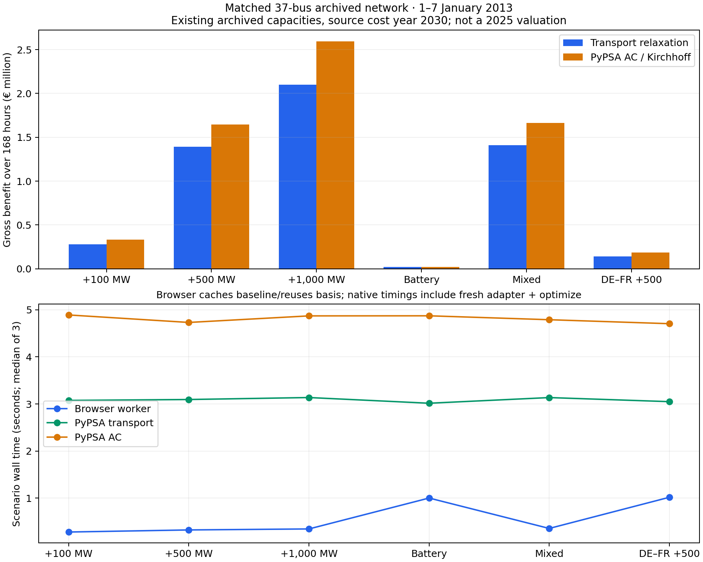

# Real-data benchmark: fast transport dispatch versus PyPSA

**Result:** the browser reproduces the same transport optimisation as native PyPSA to within one cent. Restoring Kirchhoff constraints changes investment benefits materially. Fast re-clearing is useful, but simplifying network physics requires a separate accuracy check.

Try **Load real-data benchmark** in the [/network](/network) lab. Download the [inputs](../public/research/network-benchmark/input.json), [source manifest](../public/research/network-benchmark/manifest.json), [results](../public/research/network-benchmark/results.json) and [comparison CSV](../public/research/network-benchmark/comparison.csv).



## What data are these?

A real prepared network, `networks/elec_s_37.nc`, from the [PyPSA-Eur archive on Zenodo](https://zenodo.org/records/7646728), release v0.7.0, licensed CC BY 4.0. Credit the PyPSA-Eur authors. The downloader extracts this one member using HTTP ranges and verifies its SHA-256, without downloading the entire 2.22 GB archive.

The source contains hourly **2013 weather and load**, renewable capacities estimated for **2020**, and a **2030 cost** assumption. We retain existing archived nominal capacities and disable capacity expansion. This is a technical benchmark, not an observed 2013 or 2025 market reconstruction. Source generation costs have **zero carbon price**.

We select **1–7 January 2013: 168 consecutive hours**, with 37 physical clusters, 258 nonzero-capacity generators, 94 connections, and 51 reservoir/pumped-storage units. Prepared wind/solar availability and reservoir inflows are retained; dispatch is never substituted for availability. All source cyclic storage closes over the test week, explicitly changing the source's annual water boundary. Winter results must not be multiplied by 52.

The Swedish labels `SE1 0` and `SE2 0` are physical cluster IDs, **not Swedish bidding zones**. The Poland–Sweden HVDC link `dc:14823` connects `PL1 0` and `SE2 0`, initially 600 MW. AC bounds use archived thermal ratings × 0.7; DC bounds use nominal capacity. Neither is an hourly commercial ATC reconstruction.

## The comparison isolates two questions

1. **Numerical implementation:** identical transport inputs, constraints and objective in SciPy, native PyPSA and browser HiGHS/WASM. Agreement verifies implementation, not historical accuracy.
2. **Network simplification:** native PyPSA retains the source AC topology and Kirchhoff constraints, with the same fleet, profiles, storage, period and intervention. The browser transport relaxation permits flows that need not satisfy Kirchhoff's voltage law.

Here “PyPSA AC” means linearised lossless AC-network dispatch, not nonlinear AC power flow, security-constrained dispatch or observed market clearing. A DE–FR AC intervention relaxes an existing line's thermal bound at **fixed impedance**; it is not the electrical equivalent of building a parallel circuit.

## Maths: what is the investment benefit?

For each hour, minimise generation operating cost plus a diagnostic unserved-energy penalty, subject to nodal balance, generation availability, network limits and chronological storage:

```text
C*(K) = min Σt Δt [Σg kg gg,t + 10,000 Σz uz,t]
Benefit(ΔK) = C*(K) − C*(K + ΔK)
Avoided CO₂ = emissions(baseline) − emissions(intervention)
```

Every intervention re-clears the **whole network**. Benefits here are gross operating-cost savings over the week: no capex, financing, discounting or annualisation. A positive gross benefit is not proof of a profitable project. All reported cases have zero unserved energy.

Storage is linked across all 168 hours:

```text
e[t+1] = (1 − standing_loss)^Δt e[t]
       + Δt (ηcharge charge[t] − discharge[t]/ηdischarge
             + inflow[t] − water_spill[t])
0 ≤ water_spill[t] ≤ inflow[t]
e[0] = e[H] for existing cyclic reservoirs / pumped storage
```

The test battery is 100 MW / 400 MWh in Poland, 95% efficiency per leg, empty initial and terminal inventory, and zero throughput cost to match native PyPSA StorageUnit economics. The lab's ordinary battery button separately defaults to €1/MWh per leg. Reservoir inventory is optimised but cannot end lower than it starts.

## Investment results, all for the same week

| Intervention | Browser / transport benefit | PyPSA AC benefit | Transport difference |
| --- | ---: | ---: | ---: |
| Poland–Sweden +100 MW | €280,935 | €333,336 | −15.7% |
| Poland–Sweden +500 MW | €1,392,863 | €1,646,179 | −15.4% |
| Poland–Sweden +1,000 MW | €2,098,471 | €2,593,373 | −19.1% |
| Poland battery 100 MW / 400 MWh | €18,880 | €18,805 | +0.4% |
| +500 MW and battery together | €1,411,754 | €1,665,102 | −15.2% |
| Existing DE–FR AC bound +500 MW | €139,660 | €186,827 | −25.2% |

Transport baseline cost is €915.923 million; AC baseline cost is €922.866 million. Relaxing constraints makes transport operating cost no higher than AC cost. **That does not bound investment benefit:** benefit subtracts two optimal costs, each with its own relaxation error. Here transport understates benefit; another network could reverse this.

### Why a price spread helps, but does not finish the calculation

For a congested lossless link, the shadow value of a marginal MW is the hourly endpoint price difference. A quick local estimate is:

```text
Initial price ladder(ΔK) = ΔK × Σt |λPoland,t − λSweden,t| Δt
Finite benefit(ΔK) = integral from 0 to ΔK of marginal capacity value(x) dx
```

The absolute-spread expression applies to this bidirectional link and its relevant congested direction; it is not a universal valuation for a meshed AC line. For transport, the summed initial link value is €2,809.42 per MW over the week. Therefore +500 MW gives a first-order estimate of **€1,404,710**, versus **€1,392,863** after re-clearing. At +1,000 MW the initial estimate is €2,809,420, versus €2,098,471: congestion, dispatch and prices change as capacity grows. Finite re-solving captures that saturation and interaction with other assets.

This supports using price spreads to identify where to investigate. It does not validate the map's **€229.9 million/year SE4–PL screening deadweight-loss bound**: that uses 2025 observed bidding-zone data, different geography and reduced-form slopes, and measures a potential bound rather than a specified investment. Likewise, congestion rent is a payment metric, not this system-cost difference. See the existing screening and PyPSA comparison publications for those distinctions.

## How fast is it?

Three trials on the same development machine, production Chromium worker, 1440 px viewport. Input download/parse is measured separately. The first browser request includes WASM startup and baseline calculation; later requests cache the baseline and reuse the native basis where structure permits.

| Case | Browser request, median | Native PyPSA transport | Native PyPSA AC |
| --- | ---: | ---: | ---: |
| Cold baseline | 1.82 s | 3.17 s | 5.58 s |
| +100 MW | 0.28 s | 3.08 s | 4.89 s |
| +500 MW | 0.32 s | 3.09 s | 4.73 s |
| +1,000 MW | 0.34 s | 3.14 s | 4.87 s |
| Add battery | 1.00 s | 3.02 s | 4.87 s |
| Mixed portfolio | 0.35 s | 3.14 s | 4.79 s |
| DE–FR bound relief | 1.02 s | 3.05 s | 4.70 s |

Native timing includes a fresh vectorised adapter and optimisation, with single-thread HiGHS. Browser timing includes message transfer, validation, solver work and results returned. Native PyPSA can also use warm starts; this is a workflow comparison, **not a claim that JavaScript is intrinsically faster**. Weather preparation is excluded from both sides: it is done once, not per intervention. Browser memory and real mobile-device performance were not measured.

Maximum cross-implementation cost difference: **€0.000016**. Maximum browser/Bun constraint residual: **2.24 × 10⁻¹⁰**. All cases have zero unserved energy and no simultaneous charge/discharge. Native PyPSA 1.2.4 / HiGHS 1.15.1, browser/Bun HiGHS WASM 1.15.3; precise versions and timing ranges are in the report.

## Climate warning: cheaper is not automatically cleaner

In this zero-carbon-price archived week, **every tested intervention increases modelled generation emissions**. The +500 MW link case increases emissions by about **3,593 t** in transport and **28,408 t** in AC. Those are signed dispatch differences, not average-mix proxies. Their disagreement is another reason not to infer emissions from a border's average generation mix.

A grid project enables trade; which generators expand or contract depends on costs and constraints. Cheap fossil generation can gain access to new demand. Climate-aware planning must declare carbon costs or emissions constraints, then re-clear and report both economic and emissions effects. This benchmark's cost year and absent carbon price are not a representation of today's EU ETS market.

## What this establishes, and what remains open

The prepared profiles make interactive, coupled **weekly** re-solves practical. We have an independently reproduced solver and a measured physics approximation error. This is a credible first rung for a planning workbench.

A full-year 2025 comparison remains blocked by the missing original solved NetCDF/input manifest; existing CSV dispatch outputs are insufficient. The archived source is separate evidence, not a replacement for that run. Seasonal/hydro robustness, modern fleet/costs, bidding-zone mapping, commercial capacities, held-out price/flow validation, losses and security constraints remain follow-up work. A full European year with linked storage exceeds the current browser model-size guard; no annual storage scalability claim follows from this week.

## Reproduce

```sh
python3 -m venv --system-site-packages data/pypsa-eur/benchmark-venv
# Install into the isolated offline research environment.
data/pypsa-eur/benchmark-venv/bin/pip install -r tools/requirements-network-benchmark.txt
data/pypsa-eur/benchmark-venv/bin/python tools/fetch_pypsa_benchmark.py
data/pypsa-eur/benchmark-venv/bin/python tools/build_network_benchmark.py
data/pypsa-eur/benchmark-venv/bin/python tools/run_network_benchmark.py
data/pypsa-eur/benchmark-venv/bin/python tools/run_network_benchmark.py --output-dir data/pypsa-eur/network-benchmark/python-trial-2
data/pypsa-eur/benchmark-venv/bin/python tools/run_network_benchmark.py --output-dir data/pypsa-eur/network-benchmark/python-trial-3
bun tools/run_network_benchmark.ts
bun run build
# Keep bun run preview running in another terminal.
bun tools/browser_network_benchmark.ts
data/pypsa-eur/benchmark-venv/bin/python tools/publish_network_benchmark.py
```

Raw source networks and detailed solver outputs stay ignored under `data/pypsa-eur/`; only the compact audited input, manifest, reports and figures ship with the static application. The offline Python pipeline is never bundled into the browser.
