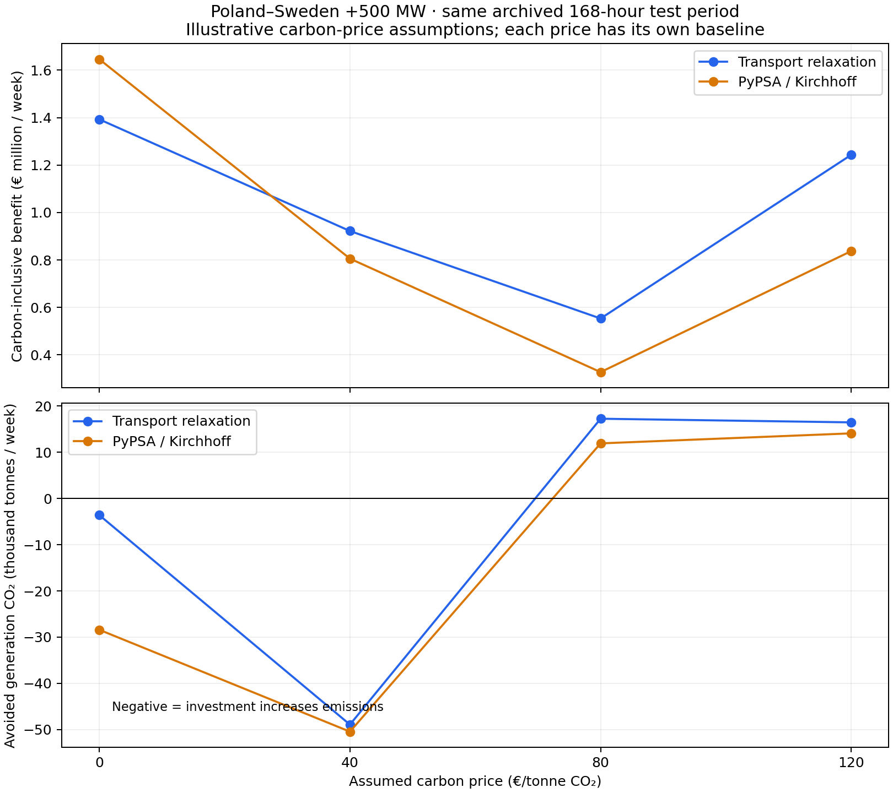

# Can grid investment accelerate decarbonisation? A carbon-price sensitivity

**It depends on which generation extra capacity enables.** In our matched archived network, the same +500 MW Poland–Sweden intervention increases generation emissions at assumed carbon prices of €0 and €40/t, but reduces them at €80 and €120/t. We should evaluate economics and climate together, with explicit assumptions, rather than label every transmission investment a carbon saving.

This follows the [real-data PyPSA/browser benchmark](network-benchmark-comparison.md). It uses the **same 168-hour January 2013 weather/load**, archived fleet and 2030 source cost assumptions. It is a methodological sensitivity, **not a contemporary investment recommendation or historical EU ETS reconstruction**. No result is annualised.



Try it in [/network](/network): choose an assumed carbon price, load the real-data
benchmark, add capacity to `dc:14823`, and evaluate. The browser re-clears its
transport model locally; the AC reference values remain in this publication.
Loading a price setting resets interventions to ensure a compatible paired baseline.

Download the [full results and numerical checks](../public/research/network-benchmark/carbon-sensitivity.json) and [comparison CSV](../public/research/network-benchmark/carbon-sensitivity.csv).

## What changes, and what stays fixed?

Only generator marginal cost changes:

```text
k[g,p] = archived marginal cost[g] + p × CO₂ intensity[g]
```

Here `p` is an **illustrative** €0, €40, €80 or €120 per tonne. Direct generation CO₂ intensity is the source fuel intensity divided by electrical efficiency. It is not lifecycle emissions. The archived costs start at zero carbon price; this experiment does not add a second ETS charge to observed market costs.

Fleet capacities, hourly availability, demand, network topology, hydro inflows, storage efficiency and weekly cyclic boundaries are identical. Capacity expansion is disabled. For **every price**, compute its own baseline, then re-clear with the intervention:

```text
B[p] = Cbaseline[p] − Cintervention[p]
AvoidedCO₂[p] = Ebaseline[p] − Eintervention[p]
```

Do not compare an intervention at €80/t with a baseline at €0/t: that would mix the investment effect with the policy effect.

## Results for Poland–Sweden +500 MW

Gross benefit and signed emissions differences **over the test week**:

| Assumed carbon price | Transport benefit | PyPSA AC benefit | Transport avoided CO₂ | PyPSA AC avoided CO₂ |
| --- | ---: | ---: | ---: | ---: |
| €0/t | €1,392,863 | €1,646,179 | −3,593 t | −28,408 t |
| €40/t | €922,147 | €805,783 | −48,925 t | −50,455 t |
| €80/t | €553,379 | €327,420 | +17,265 t | +11,930 t |
| €120/t | €1,243,169 | €837,559 | +16,478 t | +14,098 t |

A negative avoided-emissions number means **more** emissions with the intervention. Both formulations agree on the sign reversal at the sampled prices, but their valuation disagreement grows: at €80/t, transport overstates the AC benefit by about **69%**. The original zero-carbon case understated it by 15%. Transport approximation error cannot be treated as a universal correction factor.

We sampled four prices. This does not locate a precise switching price or imply that the response is monotonic between them.

## Explain this to a student

A transmission line does not produce clean electricity. It permits electricity to move. The optimiser chooses which generators use it according to their operating costs, available power and network constraints.

Imagine coal costs €35/MWh and emits 1 t/MWh, while gas costs €60/MWh and emits 0.4 t/MWh. These are **teaching numbers**, not this archive's fitted parameters. With no carbon cost, coal is cheaper. At €80/t, their effective costs become €115/MWh and €92/MWh. Carbon pricing can reverse their merit order. Renewable availability still depends on the hour; cheap clean power is not automatically available whenever a cable expands.

The actual network contains many generators and interacting constraints. Changing carbon price also changes the **baseline** congestion and marginal generators. A price of €40/t can change dispatch while still leaving emissions-intensive generation competitive; extra transmission then allows a different fossil substitution. At €80/t and €120/t in this test, the net substitution is cleaner. Aggregate emissions alone do not identify the responsible plant or certify a renewable-integration mechanism; a detailed dispatch decomposition is needed for that causal claim.

This also explains why economic benefit need not increase monotonically with carbon price. The binding constraints and price differences change. A cable's benefit is the difference between two optimised systems, rather than a fixed emissions saving multiplied by a carbon price.

## What exactly is the economic benefit at €80/t?

Separate the objective into non-carbon operating cost and the assumed carbon term:

```text
C[p] = O[p] + p × E[p]
B[p] = (Obaseline[p] − Ointervention[p])
     + p × (Ebaseline[p] − Eintervention[p])
```

For the **AC** +500 MW case at €80/t:

- Non-carbon operating-cost benefit: approximately **−€626,950**. Cleaner dispatch costs more in the archived non-carbon cost model.
- Avoided direct generation emissions: approximately **11,930 t**.
- Carbon term: approximately **+€954,370**.
- Carbon-inclusive operating benefit: approximately **€327,420**.

The positive carbon-inclusive result is consistent with higher non-carbon operating expenditure. Carbon value is already in this objective: **do not add it again** when reporting the benefit. An ETS allowance price is a dispatch incentive and accounting assumption; it is not automatically the social damage per tonne. Allowance payments, scarcity rents and other transfers require careful treatment in a societal cost-benefit analysis. These numbers exclude capex, financing, maintenance beyond the archived marginal costs, and wider welfare effects.

## Batteries and within-network constraints

The same experiment includes a Polish 100 MW / 400 MWh battery and relief of an existing DE–FR AC thermal bound. At €80/t, the battery's gross AC benefit is about **€24,143**, with **323 t** avoided over the week. At €0/t it increases emissions by about 1,454 t. Arbitrage can charge on fossil generation as well as renewables.

The chosen DE–FR constraint has zero incremental benefit at the three positive sampled carbon prices in both formulations. A bottleneck valuable in one dispatch regime need not remain valuable after the generation mix changes. This is one existing physical line at fixed impedance, **not a general within-zone planning model or a new-circuit power-flow simulation**.

## What I would build toward

Use a fast transport model to screen many candidate portfolios, then check the promising ones with the network physics and seasonal chronology appropriate to the decision. Report economic benefit, signed emissions, shortages and approximation error side by side. Test several fuel/carbon, demand, renewable and weather assumptions. A robust project should have an explainable role across plausible futures, rather than merely win one archived week.

For a climate-focused optimisation, an explicit emissions budget is another defensible formulation. That requires a declared target and shadow-price interpretation; this study does not impose one. Investment selection also needs annual chronology, capex and discounting, security/reliability constraints and credible modern data. We have not yet demonstrated those steps.

## Verification and reproduction

Sixteen cases: four carbon prices × baseline, link, battery and DE–FR intervention. SciPy and native PyPSA solve identical transport inputs independently; native PyPSA also restores Kirchhoff constraints. HiGHS/WASM independently matches the transport objectives within one cent, with feasibility and signed-emissions checks. No case has unserved energy or simultaneous charge/discharge in the WASM result. Exact residuals and versions are in the JSON report. These are numerical checks, not historical market validation; no additional browser timing claim is made for this sensitivity.

```sh
# Use the benchmark's isolated Python research environment.
data/pypsa-eur/benchmark-venv/bin/python tools/carbon_network_sensitivity.py
bun tools/check_carbon_sensitivity.ts
data/pypsa-eur/benchmark-venv/bin/python tools/publish_carbon_sensitivity.py
```

Each derived cost vector is reconstructed from the hash-checked published base input. Raw source files and detailed caches remain ignored. The original map's ENTSO-E screening methods and climate proxies are unchanged.
