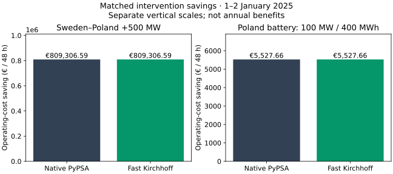
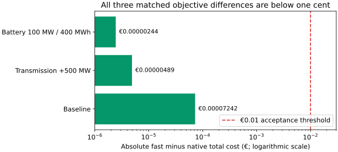
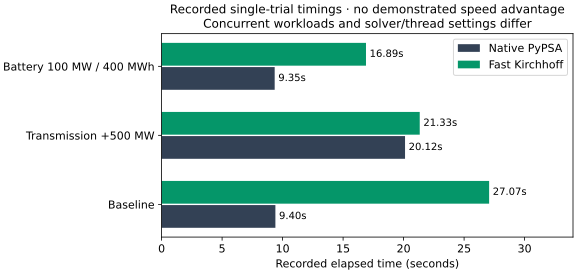

# Fast network dispatch versus native PyPSA: verification report

## Summary

**The fast Kirchhoff implementation reproduces native PyPSA operating costs and intervention savings to within one cent in the matched 2025 48-hour experiment.** Adding 500 MW to the Sweden–Poland model connection saves **€809,306.59**; adding a 100 MW / 400 MWh battery at its Polish endpoint saves **€5,527.66**. Both figures are gross system operating-cost savings for **1–2 January 2025**, excluding capital costs.

This supports using the fast solver for the tested conditional network calculations. It does **not** establish annual investment value, agreement with observed ENTSO-E prices or a speed advantage. The annual map screening and the older 2013 weekly benchmark remain separate.

## Question and experimental design

Can a browser-compatible network solver reproduce a native PyPSA baseline and the change in cost after an intervention, while retaining network and storage physics?

We compare three matched solves on a **128-node network over 48 consecutive hourly intervals**: baseline, transmission addition and battery addition. Both implementations use the same prepared demand, original renewable availability, reservoir inflows, generation costs, storage efficiencies, lossless linearised AC Kirchhoff constraints and directional HVDC limits. Dispatch is never used as renewable availability.

Existing storage starts at the original inventories and ends at inventories taken from the sequential January reference. These are fixed conditional boundaries, not optimised annual water values. The new battery starts and ends empty, with 95% charging and discharging efficiencies and zero throughput cost. Both models include free disposal and a €10,000/MWh shortage penalty.

The native reference uses PyPSA; the fast implementation uses HiGHS/WASM with cycle-based Kirchhoff equations. “AC” here means linearised lossless dispatch, not nonlinear AC power flow or security-constrained market clearing. Model cluster IDs are not verified bidding-zone identities.

## Results: intervention savings

The two panels use **different vertical scales** so the battery result remains readable. Their bar heights must not be compared across panels. Each panel compares implementations of exactly the same intervention.

| Case | Native total operating cost (€) | Fast total operating cost (€) | Native saving (€ / 48 h) | Fast saving (€ / 48 h) |
| --- | ---: | ---: | ---: | ---: |
| Baseline | 294,446,869.939562 | 294,446,869.939489 | 0.00 | 0.00 |
| Sweden–Poland +500 MW | 293,637,563.345731 | 293,637,563.345726 | 809,306.59 | 809,306.59 |
| Poland battery 100 MW / 400 MWh | 294,441,342.281184 | 294,441,342.281187 | 5,527.66 | 5,527.66 |

Savings are calculated as

$$B = C_{baseline} - C_{intervention}.$$

For example, the native transmission result is €294,446,869.939562 minus €293,637,563.345731, giving €809,306.593831. This is a reduction in total system operating cost. It is **not congestion rent, TSO revenue or investor profit**. Multiplying these winter-window results into annual values would ignore seasonality and linked storage.

## Verification: numerical agreement

| Case | Signed fast − native total cost (€) | Absolute difference below €0.01? |
| --- | ---: | --- |
| Baseline | −0.00007242 | Yes |
| Transmission +500 MW | −0.00000489 | Yes |
| Battery 100 MW / 400 MWh | +0.00000244 | Yes |

The largest absolute difference is **€0.00007242**, about **138 times smaller** than the one-cent acceptance threshold. Both implementations pass the shortage gate of 10⁻⁶ MWh; fast constraint residuals are below 10⁻⁵. Equal objectives can coexist with different optimal dispatches because of degeneracy. This report verifies objective and feasibility checks, not identity of every flow or marginal price.

The initial comparison failed because the native run omitted disposal variables present in the fast model: native cost was €41,933 higher. Matching those variables and tightening native IPM tolerances removed the discrepancy. This matters: solver agreement is meaningful only after the models themselves match. [Detailed correction and reproduction](2025-conditional-network-benchmark.md).

## Performance: what the measurements actually show

| Case | Native PyPSA (s) | Fast Kirchhoff (s) |
| --- | ---: | ---: |
| Baseline | 9.40 | 27.07 |
| Transmission +500 MW | 20.12 | 21.33 |
| Battery 100 MW / 400 MWh | 9.35 | 16.89 |

**The fast implementation was not faster in these recorded trials.** Concurrent workloads and solver/thread settings differed; native IPM used two threads. These are descriptive single-run timings, not a controlled performance comparison. Browser execution, reuse and deployment convenience are useful, but this evidence does not substantiate a 2025 speedup. A controlled repeated benchmark is required.

## Scope: three different kinds of evidence

| Evidence | What it supports | What it does not establish |
| --- | --- | --- |
| This 2025 conditional 48-hour comparison | Matched native/fast costs and paired intervention savings | Annual optimum, annual returns or observed market reconstruction |
| Separate 2013 weekly comparison | Native/fast implementation checks under older archive assumptions; network-physics sensitivity | 2025 evidence or annual scalability |
| Full-year 2025 coordination research | Verified feasible annual witnesses and numerical lower supports | Convergence, empirical price agreement or accepted annual interventions |

The [2013 weekly report](network-benchmark-comparison.md) retains its own results and timing evidence. Its weather/load, fleet and cost years differ. It is not pooled with this experiment.

The annual numerical optimisation gap measures unresolved model-objective uncertainty. It is **not percentage error against ENTSO-E day-ahead prices**. Price, generation and exchange comparisons require separate geographic, coverage and empirical gates. [Generation mismatch diagnostic](2025-generation-comparison-diagnostic.md) · [Annual coordination methods](monthly-inventory-coordination.md).

## Limitations and next acceptance gates

The prepared 2025 baseline uses zero operational carbon pricing and a 2024 nuclear-availability proxy. Fixed January terminal inventories and free disposal can affect intervention economics. No capital-cost, financing or annual welfare claim follows from the savings above.

Before replacing the map's annual scenario estimator, we need complete annual matched inputs and linked inventories, defensible convergence bounds, an audited node-to-bidding-zone mapping, matched native/fast annual intervention solves, and observed price/mix/exchange validation. No acceptance gate is relaxed by this window comparison.

## Conclusion

**The tested fast network solver passes the numerical implementation comparison against native PyPSA for the 2025 conditional window.** It reproduces the baseline and both intervention savings with retained network constraints and chronological storage. That makes it a credible implementation of this particular optimisation problem.

The evidence does not yet justify calling it a faster or historically validated annual estimator. The next step is to resolve annual feasibility/convergence, then verify matched full-year interventions and empirical realism. Until then, the window results should be read as technical verification, not annual investment recommendations.

## Data and reproducibility

[Comparison JSON](../public/research/network-benchmark-2025/comparison.json) · [Exact matched input](../public/research/network-benchmark-2025/input.json) · [Detailed benchmark methods](2025-conditional-network-benchmark.md).

Figures are generated directly from the published comparison with `tools/plot_2025_network_verification.py`; no additional solves or annualisation are involved. Comparison SHA-256: `5c474ab4822c992ec13b8c57444e38312c271a078171fcb50e3413fecf79516e`. Native/fast reproduction uses `export_2025_window.py`, `run_2025_window.py`, `run_2025_window.ts` and `publish_2025_window.py`. Large source networks remain offline and ignored.
