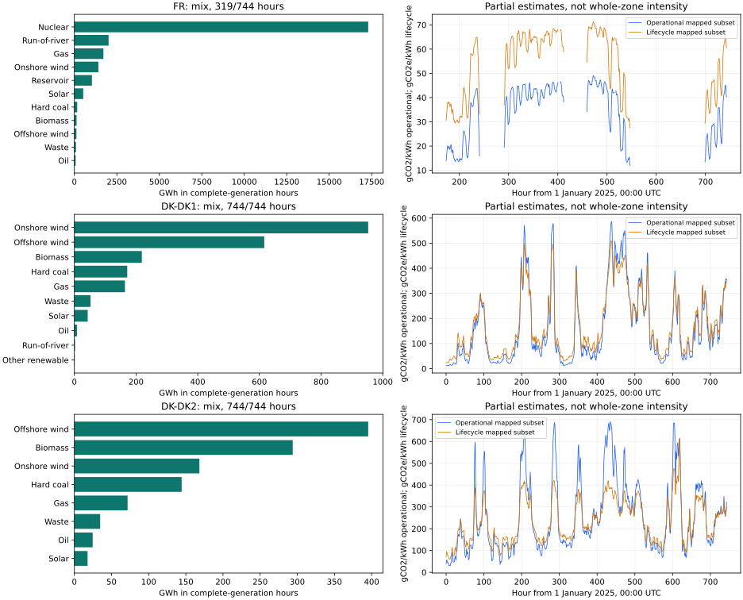
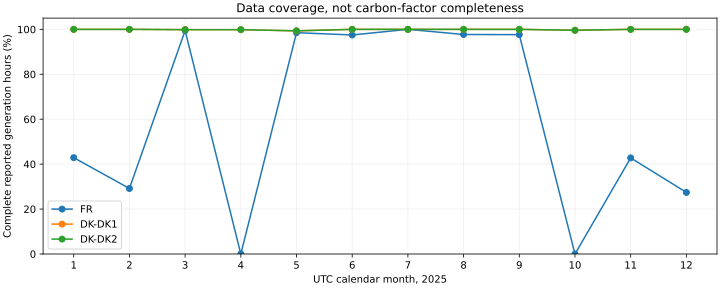

# 2025 production-carbon pilot

This experiment uses **January 2025 ENTSO-E actual generation** for France and Danish bidding zones DK1 and DK2. It is historical production accounting, not consumption intensity, marginal emissions or investment benefits. It does not replace the map climate proxy.

[Hourly observations, factor assumptions and provenance](../public/research/production-carbon-2025/results.json)

## Coverage comes first

| Zone | Complete reported-generation hours | Lifecycle mapped energy | Operational mapped energy | Full intensity estimates |
| --- | ---: | ---: | ---: | ---: |
| France | 319 / 744 | 99.31% | 98.78% | 0 |
| DK1 | 744 / 744 | 97.23% | 87.42% | 0 |
| DK2 | 744 / 744 | 94.84% | 69.31% | 0 |

**There is not yet a defensible whole-zone intensity value in this pilot.** Every zone has positive generation with unmapped factors. We retain those quantities and return null for full intensity instead of assigning zero.

The chart divides emissions by generation for the **mapped subset only**. Denmark's operational subset excludes biomass, making its coverage lower than lifecycle coverage. Differences between the curves reflect both different emissions boundaries and different subsets; they do not measure lifecycle overhead.

An hour is usable only when every reported primary-generation category has four quarter-hour samples. Missing intervals break the chart; absent categories are never assumed zero. France's 425 rejected hours need investigation before using its remaining hours as a representative month. Complete reported-category coverage does not prove complete generating-fleet coverage.

## Maths and an example

$$I_{z,t}=\frac{\sum_g G_{z,g,t}e_g}{\sum_g G_{z,g,t}}$$

G is generation in MWh; e is kg CO2/MWh for operational accounting or kg CO2e/MWh for lifecycle accounting. Intensities have the same numeric value as g/kWh. For a partial estimate, numerator and denominator contain only mapped technologies.

For gas we use 56.1 kg CO2/GJ and **assumed 50% electrical efficiency**:

$$e_{gas}=56.1\times3.6/0.50=403.92\;\mathrm{kg\ CO_2/MWh}$$

A hypothetical hour with 50 MWh gas and 50 MWh nuclear has direct combustion intensity of 201.96 g CO2/kWh. Positive generation from an unsupported fuel makes the full estimate unavailable; the known subset remains a partial calculation.

Generation bars include complete-generation hours only. Monthly intensity requires summed emissions divided by summed generation, not an unweighted average of hourly intensities. No January result is extrapolated to a year.

## Separate factor boundaries

| Technology | Operational pilot | Lifecycle pilot |
| --- | --- | --- |
| Gas | 56.1 kg CO2/GJ; assumed 50% efficiency | IPCC AR5 combined-cycle median proxy |
| Hard coal | 94.6 kg CO2/GJ; assumed 40% efficiency | IPCC AR5 pulverised-coal median |
| Lignite | 101 kg CO2/GJ; assumed 35% efficiency | Generic coal proxy |
| Wind, solar, nuclear and hydro | Zero direct combustion CO2 | IPCC AR5 lifecycle proxies |
| Biomass | Unmapped; biogenic accounting unresolved | Dedicated-biomass proxy with accounting caveat |
| Oil, waste and unsupported fuels | Unmapped | Unmapped where no existing factor is documented |

These are generic factors and assumed efficiencies, not measured country-specific fleet emissions. Zero direct combustion does not imply zero lifecycle or reservoir greenhouse gases. Operational results cover CO2; lifecycle factors cover CO2-equivalent greenhouse gases. Imports are not traced. Pumped-storage and battery discharge are excluded from primary generation because their carbon requires charging-origin accounting.

[IPCC 2006 fuel factors, chapter 2](https://www.ipcc-nggip.iges.or.jp/public/2006gl/pdf/2_Volume2/V2_2_Ch2_Stationary_Combustion.pdf) · [IPCC AR5 lifecycle factors](https://archive.ipcc.ch/pdf/assessment-report/ar5/wg3/ipcc_wg3_ar5_annex-iii.pdf)

## Next gates

1. Investigate missing intervals and audit independent monthly generation totals.
2. Resolve unsupported fuels, biomass/CHP allocation and fleet-specific efficiencies; publish sensitivities.
3. Add physical flows, demand and chronological storage-origin accounting for consumption intensity.
4. Compare paired verified dispatch scenarios for intervention emissions, separately from historical accounting.

France is national generation; DK1 and DK2 remain separate. Nothing here represents SE3 or SE4. Collection success is not model validation or avoided emissions.

See [existing carbon gates](carbon-pilot.md), [flow tracing](flow-tracing.md) and [conditional 2025 dispatch](2025-conditional-network-benchmark.md).

## Reproduce

    python tools/carbon_pilot.py --month 2025-01 --zones FR DK-DK1 DK-DK2
    python tools/publish_production_carbon_2025.py
    python -m unittest discover -s tools -p 'test*carbon*.py'

Uncached collection requires an offline ENTSO-E credential. Raw XML and credentials remain ignored; public provenance contains request parameters and hashes without security tokens. The publisher needs matplotlib and numpy in the research environment.

## Full-year 2025 collection and aggregation

The pilot now has a resumable annual collector. It fetches twelve UTC calendar
months of ENTSO-E A75/A16 generation for France, DK1 and DK2 and checks the
assembled timestamps against all 8,760 hours. Raw responses are hashed and
cached offline; missing intervals are never filled or annualized.

For complete generation and factor coverage, annual lifecycle intensity is

$$I_{year}=\frac{\sum_h\sum_k G_{h,k} f_k}{\sum_h\sum_k G_{h,k}}.$$

Here $G$ is primary electricity generated in MWh and $f$ is a consistent
lifecycle factor in g CO2e/kWh. Numerically g/kWh equals kg/MWh. This is an
energy-weighted ratio, not the arithmetic mean of hourly intensities. A full
annual estimate remains unavailable if any hour lacks reported primary
generation or has positive generation without a justified factor. Totals for
complete hours alone are explicitly partial-period quantities.

Potential cross-check sources are
[Energy-Charts public generation](https://api.energy-charts.info/) for France
and Denmark's [Energi Data Service](https://www.energidataservice.dk/)
`ElectricityBalanceNonv` dataset for DK1/DK2. The French full-year endpoint
responded with 8,760 timestamps; its calendar boundary and missing values must
be matched by UTC timestamps, not array positions. The Danish bulk request
initially encountered HTTP 429 rate limiting. A later retry returned 20,000
quarter-hour records covering only part of the year; pagination, UTC boundaries
and annual totals are not yet checked. These
providers may share original observations with ENTSO-E, so agreement is
a consistency check rather than an independent measurement validation.

Reproduce offline collection and matched-hour FR comparison with:

    python tools/collect_annual_production_carbon.py --year 2025
    python tools/compare_annual_generation_sources.py

Comparison requires the cached Energy-Charts response. Cross-provider results
must retain missing hours, geographic scope and technology mapping. Collection
and consistency checks do not resolve lifecycle factors, CHP allocation or
unknown fuels, and do not establish consumption or avoided emissions.

### Collected annual coverage results

All twelve months are collected and the assembled chronology is checked.
The public artifact was independently recomputed from hash-checked monthly
inputs before publication.

| Area | Complete generation hours / 8,760 | Hours with full pilot factor coverage | Full annual lifecycle intensity |
| --- | --- | --- | --- |
| France (national) | 5,376 | 0 | Unavailable |
| DK1 | 8,750 | 0 | Unavailable |
| DK2 | 8,750 | 5 | Unavailable |

France still has positive oil and waste generation without justified lifecycle
factors. DK1 also reports unsupported other-renewable generation; DK2 has oil
and waste. Five supported hours in DK2 are insufficient for an annual estimate.
Generation-mix totals in the artifact cover **complete-generation hours only**;
they are not whole-year generation totals.

[Download annual coverage, partial generation totals and provenance](../public/research/production-carbon-2025/annual-coverage.json)

The offline French cross-provider check compares matching hours separately for
eleven technologies and twelve months. The maximum absolute relative
difference among nonzero matched totals was about 1.47%; some technology-month
pairs have no matched data. This is not a whole-year accuracy score. Danish
comparison totals remain unchecked: after initial rate limiting, a partial
20,000-record response was cached, but full-year pagination remains necessary. Next work is to explain and resolve missing generation, audit
provider definitions and resolve the lifecycle-factor registry before exposing
a full-zone annual estimate.

## Map-wide estimates during price-separation hours

The workbench now has a **Production carbon · price-separation hours** detail
section for each displayed border. The selected hours are those where both
2025 hourly prices are observed and their absolute difference exceeds
€5/MWh. This does not establish physical congestion. For each endpoint,
we report its own generation-weighted production lifecycle estimate during
these hours; we do not attribute electricity exchanged across the border
or compute avoided emissions.

Collection is being extended to all 39 displayed areas, querying twelve
months of ENTSO-E A75/A16 generation separately. Missing responses, missing
intervals and unsupported fuels remain unavailable. The sidebar reports
complete-generation hours out of selected hours, mapped generation share
and whether the value is a mapped subset rather than full reported-area
intensity. Generic IPCC pilot technology proxies retain their earlier
limitations, including biomass accounting and fleet/CHP assumptions.

Generation domains follow the repository's EIC registry, and parsed responses
must match the requested area. Candidate domains do not themselves establish
full coverage. Swedish, Norwegian, Danish and Italian bidding zones stay
separate. German national generation is explicitly a proxy for DE-LU and
excludes Luxembourg: it must not be read as DE-LU generation. Other areas
retain their national scope.

Collection checkpoints stay offline. The static app loads a published
snapshot; it does not request ENTSO-E or require credentials. A completed
month has hash-checked inputs and UTC chronology. A full period intensity
requires complete reported generation in every selected hour and no positive
unmapped fuel; absent reported categories still do not prove zero fleet output.

[Map coverage, border summaries and provenance](../public/research/production-carbon-2025/map-summary.json)

    python tools/collect_map_carbon_2025.py
    python tools/publish_map_carbon_2025.py

The publisher can snapshot a partial collection: collected-month and
hour-coverage fields explicitly identify that limitation. Never infer zero
intensity, whole-year completeness or consumption intensity from a partial
mapped subset. Full lifecycle accounting remains subject to the C5 factor
and independent-total verification gates.

The snapshot also contains per-zone hourly arrays linked from the summary's
`hourly_files` manifest. Each has exactly 8,760 UTC-indexed rows starting
1 January 2025 00:00, with reported-generation intensity, mapped-subset
intensity and mapped generation share; unavailable values are null. These
allow the selected price-separation hours to be inspected individually,
instead of relying only on period averages. Arrays carry SHA-256 hashes.
