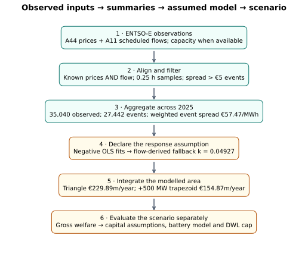
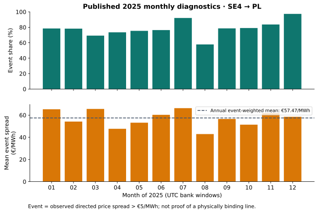
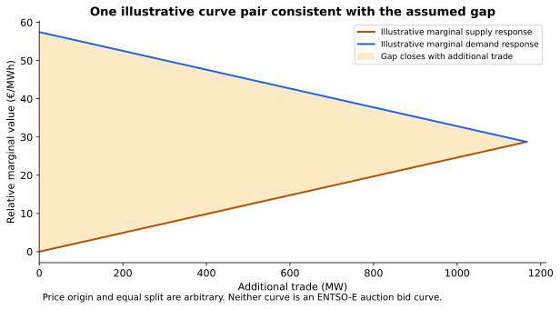
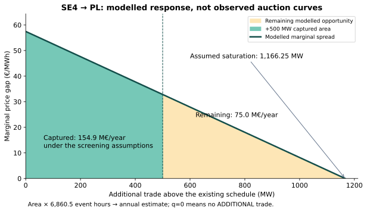
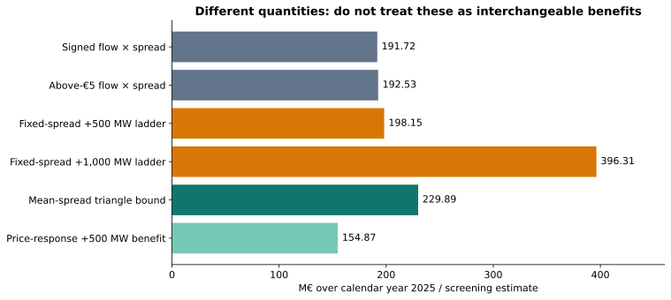

# From ENTSO-E observations to shaded welfare areas

This page follows **SE4 → PL in 2025**, from the published observations to the map's **€229.9 million/year** screening headline and the area captured by an additional line. The figures are generated from the repository's real screening publication, not demo data.

**The auction supply and demand curves are not in this dataset.** ENTSO-E A44 gives clearing prices; A11 gives scheduled cross-border flows. The application estimates a response from those observations. It cannot reconstruct the actual accepted/rejected bid areas, producer surplus or consumer surplus from this publication alone. A price difference is an opportunity indicator, not proof that a particular physical line was binding.

[Methods and maths](methods-and-maths.md) · [Detailed SE4 → PL calculation](worked-example-se4-pl.md) · [Figure data and provenance](../public/research/screening-visuals/walkthrough.json)



> **Flow provenance update — 5 October 2026:** historical descriptions below call the archived flow series scheduled exchanges. The collector requests A11 and describes physical flows, but the original 2025 request receipts are unavailable, so that classification is not verified. Equations, archived numbers and signed annual calculations are preserved. See the [flow-source audit](2025-exchange-validation.md) before interpreting these estimates as scheduled exchanges or TSO income.


## 1. What comes from the source data?

For quarter-hour t, the offline pipeline aligns:

```text
P_SE4,t   day-ahead clearing price, €/MWh (ENTSO-E A44)
P_PL,t    day-ahead clearing price, €/MWh (ENTSO-E A44)
F_SE4→PL,t scheduled directed exchange, MW (ENTSO-E A11)
s_t = P_PL,t − P_SE4,t
```

Only intervals with both prices and the directed flow known enter this row's sums. Each interval contributes **0.25 hours**. Quarter-hour samples do not necessarily imply an independently cleared quarter-hour auction throughout 2025.

The publication contains **35,040 observed samples = 8,760 hours**, including **27,442 samples with s_t > €5/MWh**. This is a defined price-screening event set. Its duration is **6,860.5 hours**, or about **78.32%** of the observed year.



These bars show actual published monthly aggregates. The ignored raw quarter-hour banks are not available in this workspace, so this page does not invent hourly prices or a spread histogram.

## 2. Aggregate the observations before drawing the model

The annual event mean weights each event equally, not each month equally:

```text
N_event = Σ_month N_event,month = 27,442
S = Σ_month(N_event,month × mean_spread_month) / N_event
  = 57.465528751548725 €/MWh
H = 0.25 × N_event = 6,860.5 hours
```

Signed flow-price rent and the fixed-spread capacity ladder are different sums:

```text
Signed rent = 0.25 × Σ_valid(F_t × s_t) / 1,000,000
Positive-event rent = 0.25 × Σ_valid,s_t>5(F_t × s_t) / 1,000,000
Fixed-spread ladder(ΔC) = 0.25 × ΔC × Σ_valid max(0,s_t) / 1,000,000
```

The ladder includes small positive spreads below €5/MWh. The event mean does not. The flow-price sum also depends on the joint variation of flow and price; it cannot be reproduced by multiplying unrelated annual averages.

| Quantity | Published 2025 value |
| --- | ---: |
| Signed flow-price rent | €191.721545 million |
| Above-€5 event flow-price rent | €192.530729 million |
| Fixed-spread +500 MW ladder | €198.154941 million |
| Fixed-spread +1,000 MW ladder | €396.309882 million |

“Rent” here is the implemented scheduled-flow-times-price-difference proxy. It does not independently measure every market-coupling settlement or a developer's revenue.

## 3. Where does the response slope come from?

The raw zone price-versus-net-scheduled-inflow OLS slopes are negative: **−0.04754017** for SE4 and **−0.01825981** for PL. Those fits do not identify a positive causal response. The model uses its declared fallback instead:

```text
Pair-level base exchange proxy = 583.125 MW
k = S / (2 × base exchange)
  = 0.04927376527463985 €/MWh per MW
```

The capacity field is null, so this proxy is flow-derived, not a verified transfer rating. It is direction-independent. The underlying directional medians and OLS samples are not published here; the JSON records their aggregate outcomes.

The screening model's effective declining spread is:

```text
m(q) = max(0, S − kq)
q_sat = S/k = 1,166.25 MW
```

q is **additional trade above the existing schedule**, not the full quantity already cleared. Saturation is an assumption implied by the fallback, not measured spare capacity.

## 4. How might two curves produce that gap?



This illustration splits the effective slope equally between two relative marginal-value curves. The common price offset and split are arbitrary; infinitely many curve pairs give the same gap. **These lines are not fitted ENTSO-E supply/demand curves, and their individual slopes are not the published zone slopes.** They explain the geometry only.

At q=0, the two zones retain a price gap. Additional beneficial trade raises the source-side marginal value and lowers the destination-side marginal value until the gap closes. The area **between** these illustrative curves represents the modelled gain from additional trade. We cannot draw the area of already accepted bids from the available data.

## 5. Shade the remaining opportunity and the intervention



The entire triangle is the screening opportunity bound:

```text
DWL = H × S² / (2k × 1,000,000)
    = 229.8925178625 million euros/year
```

For a +500 MW intervention, integrate only to the added quantity:

```text
q = min(500, q_sat)
W_line = H × (S q − 0.5 k q²) / 1,000,000
       = 154.865797 million euros/year
Remaining modelled area ≈ 75.026721 million euros/year
```

The shaded area has units **MW × €/MWh = €/hour**. Multiplying by event hours gives euros. This explains both the triangle and why a finite line captures a trapezoid rather than the whole headline value. No extra multiplication by twelve is used.

The drawing represents a **mean-spread screening approximation repeated across the event duration**, not 27,442 individually fitted auction curves. The method uses the square of the event mean, not the mean of squared interval spreads.

## 6. Put the resulting metrics side by side



The orange ladders hold observed spreads fixed while adding flow. The green areas allow the assumed spread to fall. Hence the +1,000 MW ladder can exceed the model's total opportunity bound. None of these quantities is automatically a project's bankable profit.

One subtle aggregation check: monthly DWL diagnostics sum to **€213.615170 million**, while the annual headline is **€229.892518 million**. The annual row recomputes its mean, slope and exchange proxy over the combined year. Because the response and triangle are nonlinear, the annual DWL is **not** defined as the sum of separately fitted monthly triangles. Event counts and additive rent/ladder sums are a different matter.

## 7. What happens next in the workbench?

Step 2 uses the published response assumptions for cable and battery scenarios, with the DWL cap retained. The line area above is gross estimated system welfare. Capital assumptions are then applied separately. For example, the current default 700 MW line uses €650 million capex and an 8% annual capital charge; these are scenario assumptions, not values inferred from ENTSO-E.

Battery evaluation additionally assumes charging/discharging behavior, efficiency and energy capacity; it is not another identical triangle. See the [worked example](worked-example-se4-pl.md) for the battery and financial calculations.

A network-dispatch investment experiment answers a different question by re-clearing a constrained network before and after an intervention. Keep the [2025 conditional network benchmark](2025-conditional-network-benchmark.md) and this annual price-screening publication distinct.

## Reproduce these figures

Run `tools/publish_screening_visuals.py` with numpy and matplotlib. It reads `public/research/entsoe-fast-targets.json`, verifies event counts and the event-weighted annual mean, and writes five standalone SVG figures plus JSON containing the original annual/monthly rows, derived quantities and the source SHA-256. No credentials or raw-cache publication are required.
